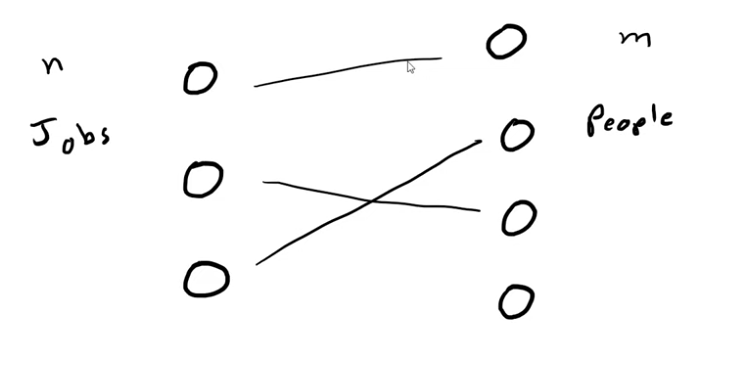

>---
> Haven't studied much these algorithms, so some parts may be wrong.
>
>---

## Basics
- $|f^*|$ is the max flow value
- $V$ is the number of nodes
- $E$ is the number of edges

## Algorithms
Based on: https://www.youtube.com/watch?v=LdOnanfc5TM

### Ford-fulkerson
- Time complexity: $\mathcal{O}(|f^*| * E)$, with a DFS traversal to find augmenting paths.

### Edmonds-Karp
- Time complexity: $\mathcal{O}(E^2 * V)$. Uses a BFS traversal to find augmenting paths.

### Capacity Scaling
???

### Dinic's Algorithm
- Time complexity: $\mathcal{O}(V^2 * E)$. Uses a combination of BFS + DFS to find augmenting paths.

### Push Relabel
- Time complexity: uses a concept of maintaining "preflow" instead of finding augmenting paths to achieve a max-flow solution: $\mathcal{O}(V^2 * E)$? $\mathcal{O}(V^3)$? or $\mathcal{O}(V^2 * \sqrt{E})$ variants.

### Hungarian
Can be used instead of Min Cost Max Flow (less to type, faster in complexity and in constant factor). Used for **Weighted Matching** (to minimize or maximize costs): https://github.com/kth-competitive-programming/kactl/blob/main/content/graph/WeightedMatching.h.

$N$ jobs to be distributed among $M$ people (every person can only get one job: $N \le M$), with a matrix of costs (for each job and person).

**Complexity:** $\mathcal{O}(N^2\cdot M)$

Note: if the nodes on the left of the bipartite matching have an incoming edge of capacity one, then we can use hungarian (instead of MCMF), because it's essentially a weighted matching.
