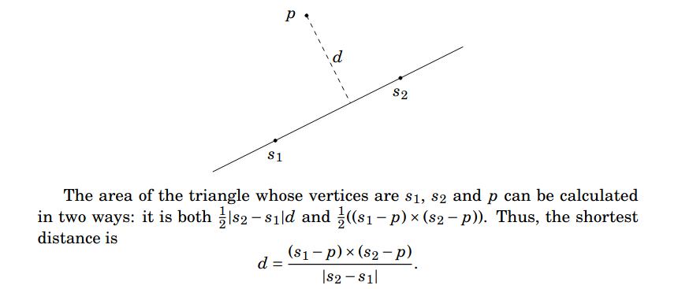
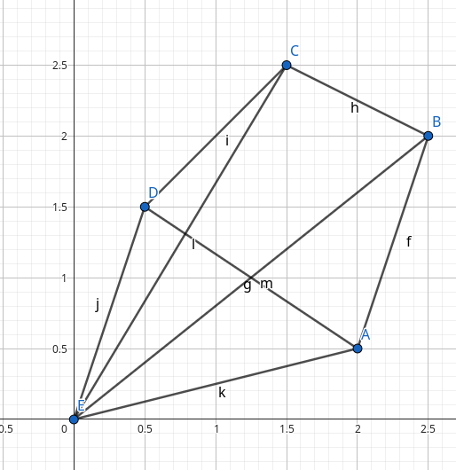
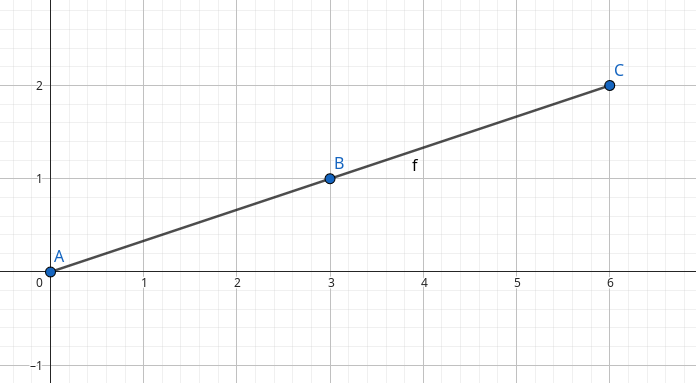
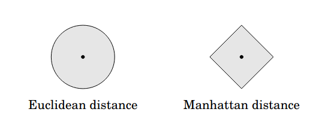
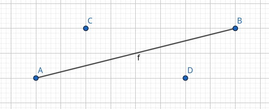
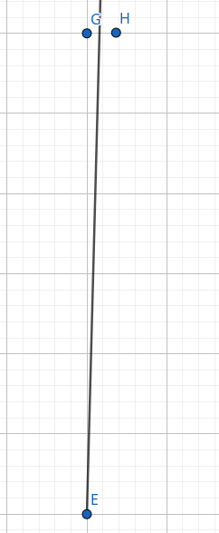
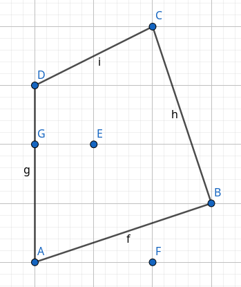

Visualize geometry stuff:
https://geogebra.org/calculator

## Comparing doubles
$$ |a − b| < \epsilon$$

## Overflowing
To avoid overflow, using templates helps and testing with simple big polygons may also help (e.g., big squares).

## Point distance from a line
Taken from https://usaco.guide/CPH.pdf#page=275

## Area - Shoelace formula
Root at point $(0, 0)$ and calculate cross product of every pair of verticies: $2 * A = \sum_{i=0}^{N-1} (p_{i}\times p_{(i + 1) \% N})$.

### Result Sign
- If the signed area is positive, the vertices are ordered in a counterclockwise direction.
- If the signed area is negative, the vertices are ordered in a clockwise direction.

This is easy to understand if we think about two triangles from the algorithm: a "big" area and a "small" area. Then, we just simulate going through the triangles.

For example, if we go counterclockwise (CCW) overall, then CCW on big and CW on small. So, big counts POS and small counts NEG. This means resulting area will be positive.

- Polygon being analyzed: ABCD
- Big triangle/area: EBC
- Small triangle/area: EDA

## Pick's Theorem and Polygon Lattice Points
$$ A = a + \frac{b}{2} - 1$$
$$ a = A - \frac{b}{2} + 1 = \frac{2*A - b}{2} + 1$$
where:
- $a$ is the number of integer points inside the polygon
- $b$ is the number of integer points on the boundary of the polygon

### How to calculate polygon lattice points?
Calculate the number of lattice points inside the polygon and on its boundary. A lattice point is a point whose coordinates are integers.

$b$ can be calculated using GCD of each segments X and Y length. For example:

Segment length (6, 2): GCD = 2, so there are 2 smaller segments with points on integer coordinates.

## Distances

### Maximum manhattan distance
$$(x', y') = (x + y, y - x)$$
$$|x_1 - x_2| + |y_1 - y_2| = max(|x'_1 - x'_2|, |y'_1 - y'_2|)$$

## Segment intersection

Check [cses/geometry/line_segment_intersection](../../cses/geometry/line_segment_intersection/intersection.cpp)

## Point in polygon
Ray casting approach, with vertical line slightly tilted to the right.

Check [cses/geometry/point_in_poly](../../cses/geometry/point_in_poly/point_in_poly.cpp)

In this image, we want to count an intersection for point D, not C (vertical line that goes from the point itself C/D to infinite positive y). This can be done simply by: $A.triangle(B, P) < 0$, with $A.x <= p.x < B.x$ (check the implementation).

On this image, point G is on the same X as P, but is considered to be at the left of the slightly tilted ray. Point H is considered to be on the right.

In this polygon, G is handled separately, E has one intersection (odd so inside) and F has two intersections (even so outside). In the point F case, the intersections are segment AB and segment CB. C is considered to be on the left and not on the right of the slightly tilted ray from point F.

## Line Segment Intersection between N points
The complexity of the Bentley–Ottmann algorithm is $\mathcal{O}((N + K)\log N)$, where K is the number of intersection points. $K$ can be up to $\mathcal{O}(N^2)$, so this cannot be used for every problem.

For a problem that allows $\mathcal{O}(N^2)$, just use the brute force algorithm. Otherwise, use this plane sweep algorithm to detect line segment intersections.

First, sort every segment by X and Y (or Y and X, but here we will assume first by X then by Y).

The **events** are the bounds of each segment, as well as the intersection points. We maintain an **active segment list**, sorted by Y.

Events:
- Begin segment: check intersection with `lower_bound` and `prev(lower_bound)`
- End segment: check intersection between `prev(it)` and `next(it)`
- Intersection point: swap orders of the intersecting segments. Check intersection with adjacent segments. Each swapped segment only needs to check with another segment.

After checking intersections, we add them to the events (just be careful not to add intersections already there, or intersections which are before the sweep line).

Degenerate cases are a big issue in this algorithm, so check [edge_cases.md](edge_cases.md).

Problem when an adaptation of this algorithm is useful (only need to detect the first intersection): https://usaco.org/index.php?page=viewproblem2&cpid=943.

## Rotating Calipers and Anti-podal points
Notes: [rotating_calipers.md](rotating_calipers.md)

## Cool problems
### Sliding Window with wrap-around
https://leetcode.com/problems/maximum-number-of-visible-points/description/

### Angular Sweep (Disk Partial Covering Problem)
https://leetcode.com/problems/maximum-number-of-darts-inside-of-a-circular-dartboard/description/

### Convex Hull
- https://codeforces.com/contest/1299/problem/C: Not obvious it can be solved with lower convex hull (check editorial).

## Centers of Polygons

### Geometric Median: Fermat-Weber Point
This point is called the **Geometric median**. This is the problem of finding a point minimizing the sum of distances from given points: [https://en.wikipedia.org/wiki/Geometric\_median](https://en.wikipedia.org/wiki/Geometric_median)

**Minimizes the sum of distances:**
$$\displaystyle \arg\min_{x} \sum_{i=1}^{n} \|x - v_i\|$$

### Center of Mass
This is also called the **area centroid** of a polygon.

**Minimizes:**
$$\displaystyle \arg\min_{x} \iint_{P} \|x - r\|^{2}\, dA$$

Useful for:
- Balance/tipping checks: e.g., does table fall?
- Expectation of random points
- Continuous L2 minimizer over area, moment of inertia minimizer

### Center of Minimum Enclosing Circle
**Minimizes the maximum distance:**
$$\displaystyle \arg\min_{x} \;\max_{i} \|x - v_i\|$$

### Mean of vertices
**Minimizes the sum of squared distances to vertices:**
$$\displaystyle \arg\min_{x} \sum_{i=1}^{n} \|x - v_i\|^{2} \;=\; \frac{1}{n}\sum_{i=1}^{n} v_i$$

>---
>The proof isn't too complex. It comes from directly plugging the answer in the formula above.
>
>---

**Weighted version:**
$W=\sum w_i$ and $\mu_w=\frac{1}{W}\sum w_i v_i$

Basically:
For $w_i\ge 0$,

$$
\arg\min_x \sum_i w_i\|x-v_i\|^2
= \frac{\sum_i w_i v_i}{\sum_i w_i},
$$
