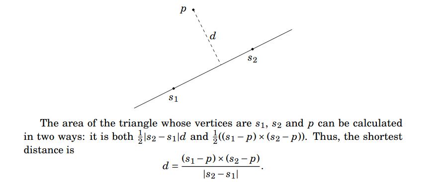
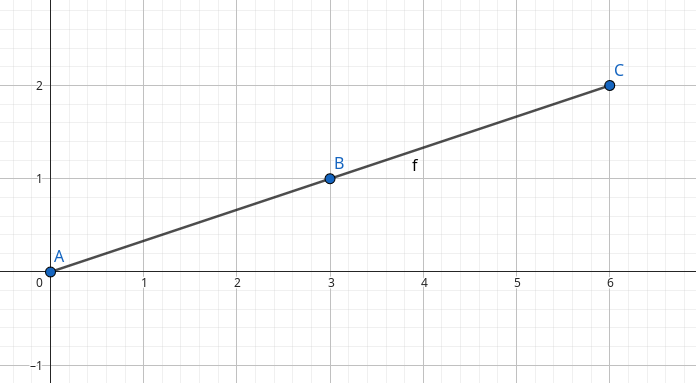
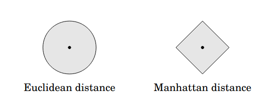
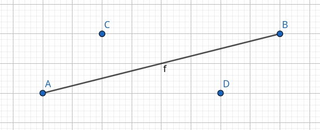
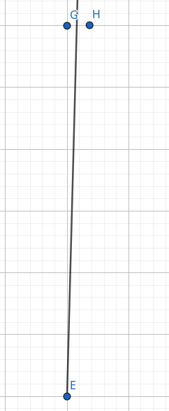
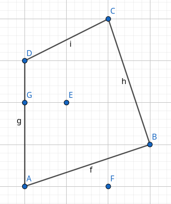

Visualise geometry stuff:
https://geogebra.org/calculator

## Comparing doubles
$$ |a − b| < \epsilon$$

## Point distance from a line
Taken from https://usaco.guide/CPH.pdf#page=275

## Area - Shoelace formula
Root at point (0, 0) and calculate cross product of every pair of verticies: $\sum_{i=0}^{N-1} (p_{i}\times p_{(i + 1) \% N})$.

## Pick's Theorem
$$ A = a + \frac{b}{2} - 1$$
where:
- $a$ is the number of integer points inside the polygon
- $b$ is the number of integer points on the boundary of the polygon

$b$ can be calculated using GCD of each segments X and Y length. For example:

Segment length (6, 2): GCD = 2, so there are 2 smaller segments with points on integer coordinates.

## Distances

### Maximum manhattan distance
$$(x', y') = (x + y, y - x)$$
$$|x_1 - x_2| + |y_1 - y_2| = max(|x'_1 - x'_2|, |y'_1 - y'_2|)$$

## Segment intersection

Check [cses/geometry/line_segment_intersection](../../cses/geometry/line_segment_intersection/intersection.cpp)

## Point in polygon
Ray casting approach, with vertical line slightly tilted to the right.

Check [cses/geometry/point_in_poly](../../cses/geometry/point_in_poly/point_in_poly.cpp)

In this image, we want to count an intersection for point D, not C (vertical line that goes from the point itself C/D to infinite positive y). This can be done simply by: $A.triangle(B, P) < 0$, with $A.x <= p.x < B.x$ (check the implementation).

On this image, point G is on the same X as P, but is considered to be at the left of the slightly tilted ray. Point H is considered to be on the right.

In this polygon, G is handled separately, E has one intersection (odd so inside) and F has two intersections (even so outside). In the point F case, the intersections are segment AB and segment CB. C is considered to be on the left and not on the right of the slightly tilted ray from point F.

