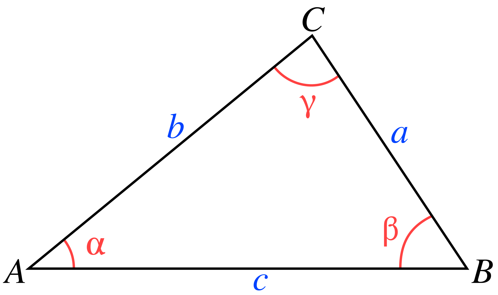

## Using trigonometry functions
Careful when using `cos` and `sin` to make sure the values are in $[-1, 1]$. Otherwise, undefined behaviour.

Cool problem: https://usaco.guide/problems/lc-maximum-number-of-darts-inside-of-a-circular-dartboard/solution

### `atan2` range
https://en.cppreference.com/w/cpp/numeric/math/atan2

Point Q relative to P: `atan2(q.y - p.y, q.x - p.x)

Q in `n-th` quadrant relative to P:
- Q1: $[0, \frac{\pi}{2}]$
- Q2: $[\frac{\pi}{2}, \pi]$
- Q3: $(-\pi, -\frac{\pi}{2}]$
- Q4: $[-\frac{\pi}{2}, 0]$

### `acos` range
https://en.cppreference.com/w/cpp/numeric/math/acos

$[0, \pi]$

## Law of sines
https://en.wikipedia.org/wiki/Law_of_sines

$$ \frac{a}{\sin{\alpha}} = \frac{b}{\sin{\beta}} = \frac{c}{\sin{\gamma}} = 2 * R$$

where:
- R is the radius of the triangle's circumcircle (the circle outside the triangle that touches the points of the triangle)

Or just:
$$ \frac{\sin{\alpha}}{a} = \frac{\sin{\beta}}{b} = \frac{\sin{\gamma}}{c}$$

## Law of cosines
https://en.wikipedia.org/wiki/Law_of_cosines

$$c^2 = a^2 + b^2 - 2*a*b*\cos{\gamma}$$

