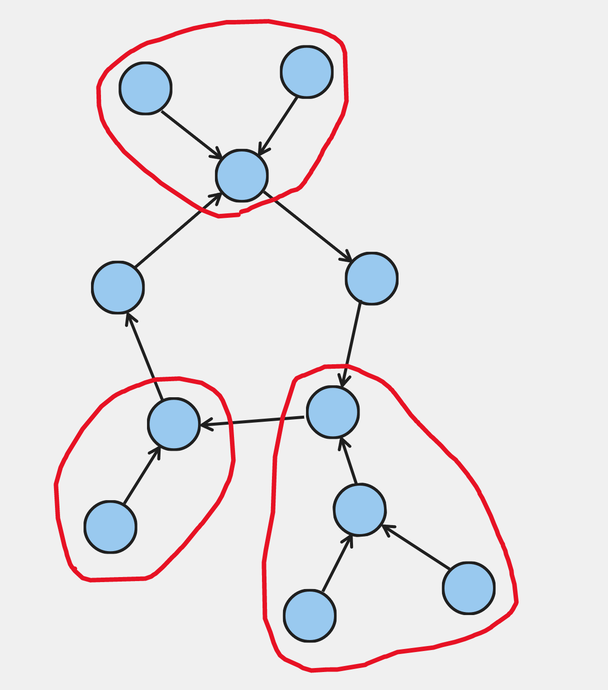

From https://usaco.guide/problems/cses-1160-planets-queries-ii/solution:

All functional/succesor graphs are of the general form: 

They can be broken down into some "components", circled in red (see above link for explanation).
