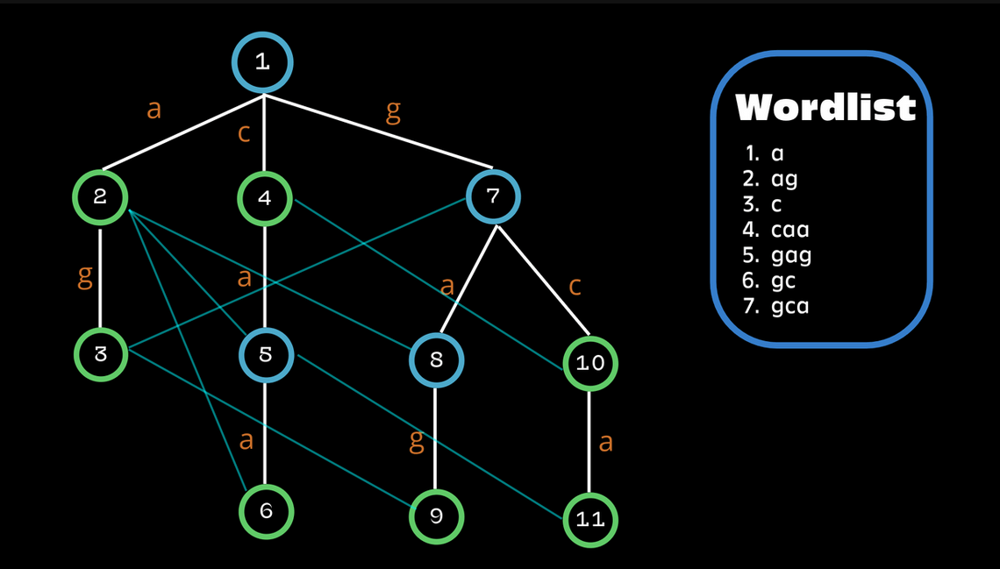
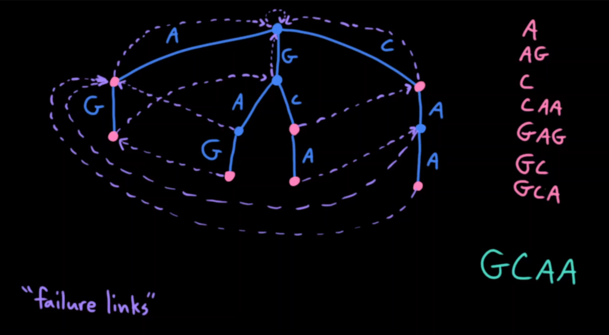
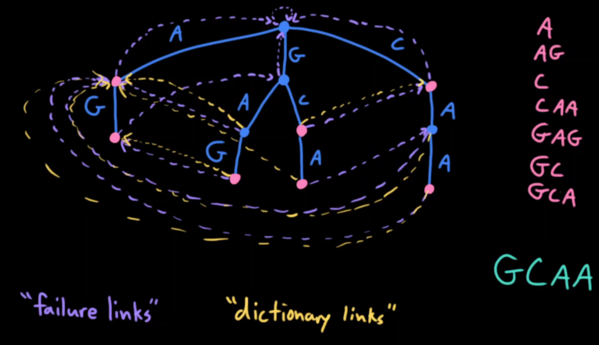

# Aho-Corasick Pattern Matching
Based on https://usaco.guide/adv/string-search#aho-corasick.

Also, check Youtube videos: [Aho-Corasick Automaton basics](https://www.youtube.com/watch?v=O7_w001f58c) and [Aho-Corasick Dictionary Links](https://www.youtube.com/watch?v=OFKxWFew_L0).

After watching these videos, the reasoning and application of the Aho-Corasick are easy to understand.

Just note that, for the dictionary links, we may need to follow several in a row. See example below.

## Pre-requisites
- **Tries**: a small note on how they work in the next s ection.

## General reasoning
**Preprocess a group of patterns into a Trie**, augmented with additional information: the **failure links** and the **dictionary links**. The Trie should have references or booleans indicating a match with a specific pattern.

Then, we just go over a text where we want to find the occurrences of all patterns.

### Tries
A node represents a string given by the path from to root to the node (each edge represents a character). That string is a prefix of a string from the pattern list.

## Failure Links (aka Suffix Links)
**Connect every single node to the node representing the longest proper suffix of the original node.** Proper suffix just means a suffix that is not the complete string.

This image illustrates the failure links. The failure links for $[1, 2, 4, 7]$ point to the root.



### Building Failure Links
These can be built using a **BFS**, **after building the Trie** with all of the patterns.

1. The suffix links for the root and all its immediate children point to the root node.
2. For all other nodes $u$ with parent $p$ and letter $c$ on the edge $p \rightarrow u$ the suffix link can be computed by following $p$'s failure link and transitioning to letter $c$ from there.

Run through the above example with this algorithm.

## Running algorithm
We can just loop through the main text string $S$, maintaining the current node at the trie such that the string the node represents is the longest suffix ending in $i$.

When transitioning from $i$ to $i+1$ in $S$ there only are two choices:
1. If $node$ has an outgoing edge with letter $S_{i+1}$, then move down the edge.
2. Otherwise, follow the failure link of $S_i$ and transition to letter $S_{i+1}$ from there.

In the second case, we may need to follow several failure links in a row.

## Dictionary Links
### Reasoning and Example
When words can be substrings of other words, running the algorithm for pattern matching will miss some matches (see Youtube video link in first section).

Test the example on the image below (the same as above, but has the links for the top-level nodes).



It would find `GC`, `GCA`, `CAA`, missing `A` twice and `C`.

To avoid this, we can augment the Aho-Corasick with **Dictionary Links**

### Definition
**Dictionary Links** connect every node to the first word it encounters when traversing failure links as far as possible.

They basically allow us to find smaller words, words that are suffixes of our current node (hence the definition based on failure links).

### Building
During the building of the Failure Links using a BFS, we can also build the dictionary links.

There are 2 options:
1. The node's failure link points to a node that corresponds to a word: the dictionary link is the same as the failure link.
2. The node's failure link points to a node that is not a word: the dictionary link points to the dictionary link of the failure link node (it could result in "no dictionary link").


### Example with Dictionary Links
You can test the algorithm to build the dictionary links and to do pattern matching on the following example.



Consider this example:

```
text = ababababab...
words = [a, b, ab, ba, aba]
```
Here, we need to traverse multiple dictionary links in one step. After we have processed `ab`, and are processing `a`, we need to detect `aba`, `ba` and `a`. We can do this by **following multiple dictionary links in a row**, until a "no dictionary link" is found.


## Problems
- https://cses.fi/problemset/task/2102/
- https://codeforces.com/contest/963/problem/D

I managed to solve these without Aho-Corasick, just using Suffix Array to separately find the occurrences of each pattern.
