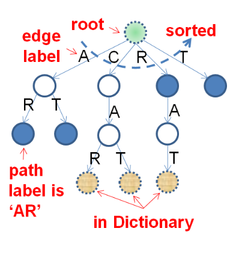
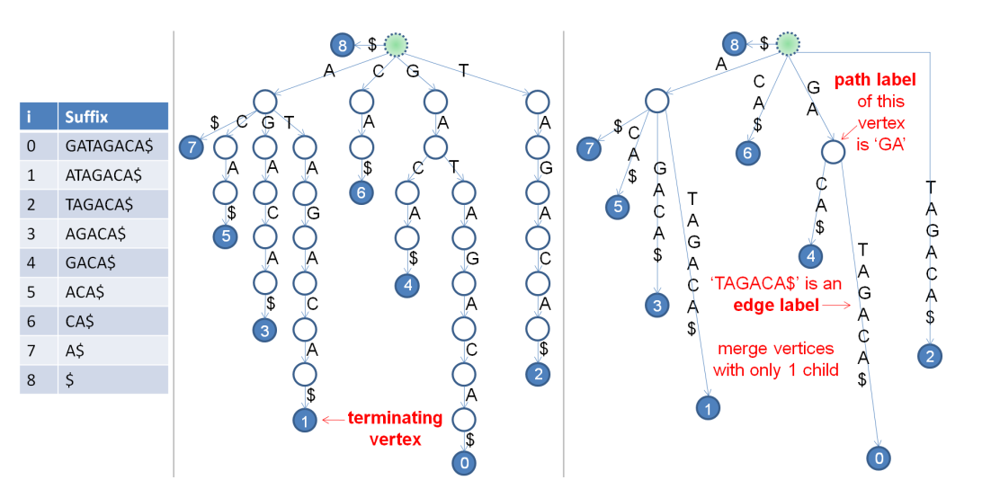

# Suffix Trie, Suffix Tree and Suffix Array
Based on CP4 book, by Steven Halim.

## Suffix Trie
A suffix trie of a set of strings is a tree of all possible suffixes of strings in S.
- Each vertex can be connected up to $|\Sigma|$ number of vertices (size of alphabet).
- The common prefix of two suffixes is shared
- Each vertex has 2 boolean flags: exists a suffix or word that terminates in that node.

For example:


`Dictionary = {‘CAR’, ‘CAT’, ‘RAT’}`

After sorting and removing duplicates, we have:

`Suffixes = {‘AR’, ‘AT’, ‘CAR’, ‘CAT’, ‘R’, ‘RAT’, ‘T’}`



### Applications
Suffix Trie is typically used for a dictionary. Assuming it has been built for a set of strings, determining if a pattern P exists in the dictionary (Suffix Trie) can be done in $\mathcal{O}(m)$.

A bBST may also work for this use case. The complexity with a bBST is $\mathcal{O}(m * \log N)$, as each comparison costs $\mathcal{O}(m)$.

## Suffix Tree
Suffix Tree of a string is a Suffix Trie where vertices with only one child are merged (path compression). Much more compact with at most $\mathcal{O}(N)$ vertices (and edges).


`$` is assumed to be smaller than any character of the string.

**Suffix Trie** on the middle, **Suffix Tree** on the right:



### Applications
Suffix Tree preprocesses the string, not the patterns.

Assuming it is built on a string T, we can perform:
- **string matching** in $\mathcal{O}(m + occ)$, where `m = pattern.size()` and `occ` is the number of occurrences of the pattern in T.
    - Traverse the Suffix Tree until matching the complete pattern. The size of the subtree found respects: `subtree_size <= 2 * occ`.
- **longest repeated substring** in $\mathcal{O}(N)$: longest substring that occurs at least twice.
    - Find the deepest internal vertex (not leaf) using a DFS/BFS.
- **longest common substring** in $\mathcal{O}(N)$: for 2 or more strings.
    - Build a suffix tree with all strings
    - Find the deepest internal vertex that contains children of every string (it a prefix that is shared by suffixes of every string)
    - Consider every string needs to be marked differently at its end (for instance, `s = "steven$"`, `t = "seven#"`, `u = "eve@"`).

## Suffix Array
Here, we will focus more on the applications of the suffix array than on how to build it. https://usaco.guide/adv/suffix-array contains a good explanation on each step of the building process and the general reasoning.

### Applications
- **String matching** in $\mathcal{O}(m + \log n)$
- Finding **LRS** in $\mathcal{O}(n)$
- Finding **LCS** (Longest Common Substring) in $\mathcal{O}(N)$
- Other substring related applications

For many of these applications, and to better understand the algorithms, it may be useful to visualize them in a **Suffix Tree** and then convert the algorithm to the Suffix Array and LCP.

### Simplest Problems
- Suffix Array construction and `SA` usage: [Kattis - suffixsorting](https://open.kattis.com/problems/suffixsorting)
- Suffix Array `LCP` usage through Longest repeated substring $(LSR)$: [Kattis - repeatedsubstrings](https://open.kattis.com/problems/repeatedsubstrings)

Library checker problems:
1. https://judge.yosupo.jp/problem/suffixarray
2. https://judge.yosupo.jp/problem/number_of_substrings
3. https://judge.yosupo.jp/problem/longest_common_substring

### Unique substrings calculation
See library checker problem 2.

A crucial observation to be made for this problem is that every substring can be represented as a prefix of some suffix

#### Number of (non-unique) substrings
A string of size $n$ has $ n + n - 1 + ... + 1$ = $n * (n + 1) / 2$ total substrings.

#### LCP array observation
If the LCP value at a certain index is $X$, then there are $X$ characters in common between the two suffixes. In other words, there are $X$ repeated substrings between those two suffixes, since they come from the same larger string.

The substrings counted from each prefix are only the prefixes (otherwise, there would be overcounting).

Example string: $\texttt{"AZAZA"}$

| LCP | Sorted suffixes | What to do | What substrings we are considering|
|:-:|:-     |:-| :-:|
|0  |A      | + 1 - 0 |   A |
|1  |AZA    | + 3 - 1 | AZA, AZ, <span style="color:yellow">A</span> |
|3  |AZAZA  | + 5 - 3 | AZAZA, AZAZ, <span style="color:yellow">AZA</span>, <span style="color:yellow">AZ</span>, <span style="color:yellow">A</span> |
|0  |ZA     | + 2 - 0 | ZA, Z |
|2  |ZAZA   | + 4 - 2 | ZAZA, ZAZ, <span style="color:yellow">ZA</span>, <span style="color:yellow">Z</span> |

Since we are using suffixes, we will only be considering at each iteration the substrings starting at the index of each suffix, i.e., the prefixes (meaning that we do not consider substrings that do not start at the first character of the suffix).

- $i = 0$, $LCP[i] = 0$, $len(suffix) = 1$, we add $1$
- $i = 1$, $LCP[i] = 1$, $len(suffix) = 3$, we add $3 - LCP[i] = 3 - 1 = 2$
- $i = 2$, $LCP[i] = 3$, $len(suffix) = 5$, we add $5 - LCP[i] = 5 - 3 = 2$
- $i = 3$, $LCP[3] = 0$, $len(suffix) = 2$, we add $2$
- $i = 4$, $LCP[4] = 2$, $len(suffix) = 4$, we add $4 - LCP[i] = 4 - 2 = 2$

In total, $result = 1 + 2 + 2 + 2 + 2 = 9$ or use an [easier formula](#formula).

Basically, we do not count substrings of the current suffix that are common with the previous suffix (considering always substrings that start at the first character of the suffix). We are essentially removing the substrings that come from the common prefixes.

#### Formula
An easier formula to implement:
$$ \frac{n (n + 1)}{2} - \sum_{i = 1}^{n}{LCP[i]}$$


### Longest common substring
Explanation taken from [https://cs.stackexchange.com/questions/9555/computing-the-longest-common-substring-of-two-strings-using-suffix-arrays](https://cs.stackexchange.com/questions/9555/computing-the-longest-common-substring-of-two-strings-using-suffix-arrays):
```
Given two strings A and B, we concatenate them as S=A#B, where # is a character not present in both A and B. The reason for choosing such a character is so that when computing the LCP of two suffixes, say ab#dabd and abd, the comparison will break off at the end of the first string (since it only occurs once, two different suffixes will never have it in the same position), and won't "overflow" into the other string

Now, you should be able to see why you only need to see consecutive values in the LCP array (the argument is based on contradiction and the fact that the suffixes in SA are in lexicographic order). Keep checking the LCP array for the maximum value such that the two suffixes being compared do not belong to the same original string. If they don't belong to the same original string (one begins in A and the other in B), then the largest such value is the length of the largest common substring.
```

Actually, in the implementation, we do `s = a + '#' + b + '$'`


### Code
Find the code [here](../../cp4/ch6/sa_lcp.cpp), adapted from the CP4 book.
