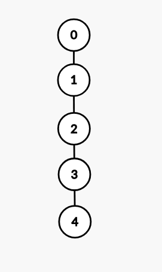

## Diameter
To find the diameter of a tree, we can just do 2 DFS's. In one, we will get the farthest node from the current node (0). Then, we can just find the farthest node from that node and their distance is the diameter.

## Binary Jumping

Check the link: https://usaco.guide/plat/binary-jump?lang=cpp

Example:



The table represents the `2^k`-th ancestor of node `i`.

| `i` | `2^0` (k=0) | `2^1` (k=1) | `2^2` (k=2) |
|-----|-------------|-------------|-------------|
| 0   | -1          | -1          | -1          |
| 1   | 0           | -1          | -1          |
| 2   | 1           | 0           | -1          |
| 3   | 2           | 1           | -1          |
| 4   | 3           | 2           | 0           |

## Build the Table

The way to compute is simple:
- In ascending order of $k$, compute this for every node $i$: $$\texttt{up}[\texttt{i}][\texttt{k}] = \texttt{up}[\texttt{up}[\texttt{i}][\texttt{k}-1]][\texttt{k}-1], \\\textit{if}\ \ \texttt{up}[\texttt{i}][\texttt{k}-1] \neq -1$$

If we always use $0$ instead of $-1$, then we don't need the $\textit{if}$.

Example code (not my implementation, from USACO): [binary_jumping.cpp](src/binary_jumping.cpp). Also check https://cses.fi/problemset/task/1687 (my code).

### Find $k$-th parent

To jump $k$ nodes up in the tree, we can just iterate over each bit in $k$ and, if it's active, we go through the parent corresponding to that number.

```cpp
if ((k & (1 << pw))) {
    x = up[x][pw];
    if (x == -1) {
        break;  // stop when we're past the root
    }
}
```
### Lowest Common Ancestor
https://usaco.guide/CPH.pdf#page=177

#### Method 1

Idea:
- Make nodes $a$ and $b$ be in the same level
- In decreasing order of the number of jumps in $2^k$ (similar to binary search down/up instead of left/right), test if the nodes end up in the same node. We want to find the highest node that the nodes can go up to that is not common to both (then the LCA is just the parent). Note that it needs to be decreasing order and we should move the nodes $a$ and $b$ once we find a valid node (i.e., a node that is not the same for both).

Check https://cses.fi/problemset/result/13181991/ (first submission)

Note that if we do not go in increasing order, there are counterexamples. For instance, needing to go up 2 nodes (LCA is the 3rd node):
We would go up once and then we would not be able to go up more (if in increasing order). The powers of 2 in decreasing order ensures we find what we want.


### Additional notes
We can also include an additional column, to make sure there are no problems: instead of doing just `ceil(log2(n + 1))`, we can just add `+1` at the end.


### Example problems
- Go through k nodes in a successor graph: https://cses.fi/problemset/task/1750
- Determine minimum number of jumps to get from node $a$ to $b$ in a successor graph: https://cses.fi/problemset/task/1160 (similar to A from ONI 2025)
